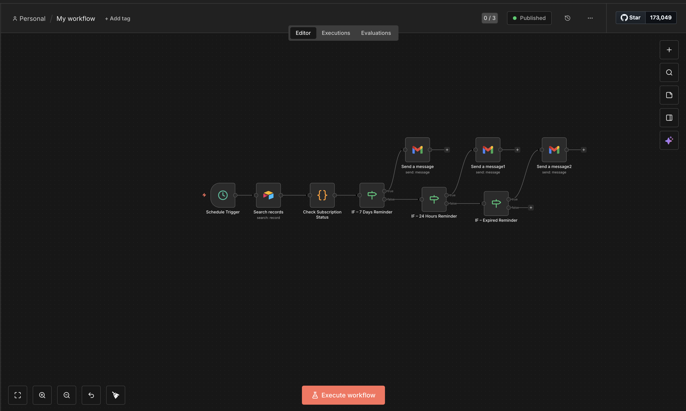
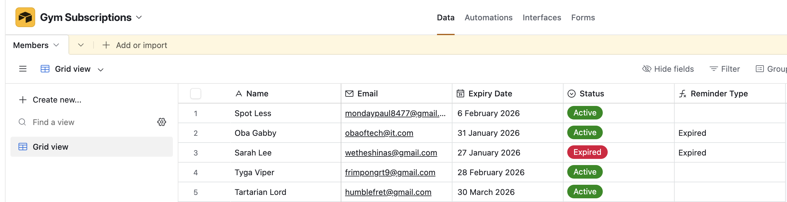
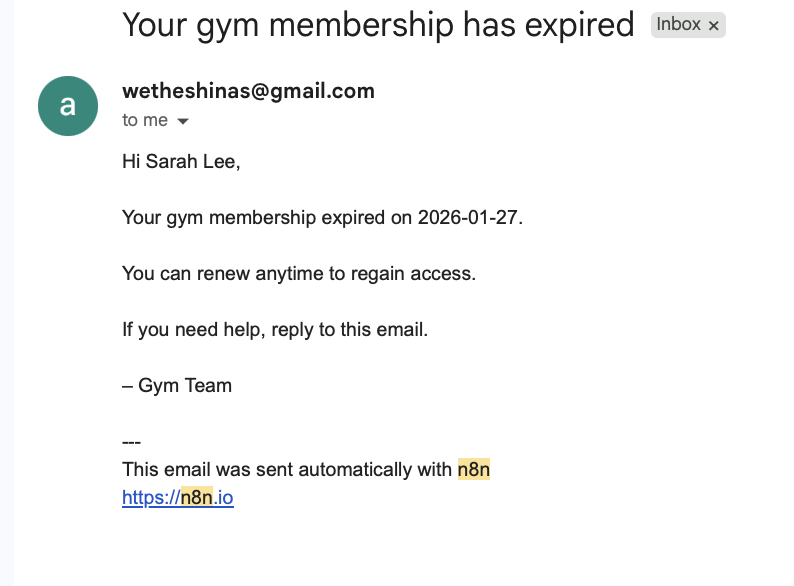

Gym Membership Automation (n8n + Airtable)

## Overview

This project is a real-world business automation that solves a common operational problem in gyms:
members are not reminded when their subscriptions are about to expire or have expired.

Using n8n and Airtable, this automation:

- Detects expiring and expired memberships daily

- Sends timely reminder emails

- Eliminates manual follow-ups

- Improves renewal rates and customer experience

This project was built as a practical automation challenge, not a demo.

## Screenshots

### n8n Workflow Overview
This screenshot shows the complete automation flow, including the schedule trigger, Airtable lookup, logic routing, and email notification steps.

---

### Airtable Members Table
The Airtable base used to store gym members, subscription expiry dates, and email addresses.

---

### Email Notification Example
An example of an automated email sent to a member when their subscription expires.

## Problem Statement

Most gyms manage memberships manually or with disconnected tools. As a result:

- Members forget renewal dates

- Staff must manually check records

- Expired members are lost silently

- No structured follow-up exists

There was no automated reminder system.

## Solution

A daily automation workflow that:

- Reads all members from a database

- Calculates how many days remain until expiry

- Automatically sends:

📅 7-day reminder

⏰ 24-hour reminder

❌ Expired notification

No manual intervention required.

## Tools & Stack

- n8n – Workflow orchestration

- Airtable – Membership database

- Gmail (SMTP) – Email delivery

- JavaScript (Function Node) – Date logic & conditions

## Database Structure (Airtable)
Field Name	                       Type	                                    Purpose
Name	  	                       Text                                  Member name
Email	         	               Email                                 Notification recipient
Expiry Date		                   Date                                  Subscription expiry
Status		                       Select                                 Active / Expired
days_remaining		               Number                                 Auto-calculated
notification                       Type		                               Routing logic

## Automation Logic (High-Level)

Schedule Trigger (daily at 8am)
        ↓
Airtable – Fetch all members
        ↓
Function – Calculate days_remaining
        ↓
IF: days_remaining == 7
        → Send 7-day reminder
        ↓
IF: days_remaining == 1
        → Send 24-hour reminder
        ↓
IF: days_remaining < 0
        → Send expired notice

Each member receives only one relevant message per day.

## Key Implementation Details

Days Remaining Calculation

Uses JavaScript inside n8n Function node

Automatically updates daily

Handles negative values for expired memberships

Email Provider Independence

Emails work for Gmail, Yahoo, Outlook, and any provider

Gmail is used only as the sender

Testing & Validation

Test members created with different expiry dates

Workflow executed daily

Confirmed:

Correct message routing

No duplicate messages

Accurate day calculations

Successful email delivery

## Results

⏱️ Zero manual follow-ups

📬 Timely member notifications

🧠 Predictable renewal communication

📈 Improved operational discipline

This automation is production-ready for small gyms.

## Scalability & Extensions

Future improvements could include:

WhatsApp reminders

SMS notifications

Admin dashboard

Auto-renewal payment links

CRM integration

## Why This Project Matters

This project demonstrates:

Business-first thinking

Automation design

Workflow logic

Real operational impact

Client-ready documentation

It is intentionally simple, practical, and valuable.

## Author

Oluwasina Asaolu
Automation • AI • Product Thinking